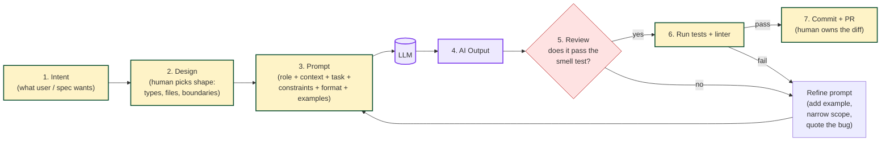

# AI Prompt Cycle: From Intent to Merged Code

The senior workflow with Copilot/Cursor/Claude is never "type prompt, paste
output". It is a loop with explicit gates. If you cannot draw this loop on a
whiteboard, the interviewer assumes you are a pasta-coder.

## What to say out loud

> "AI never owns the design or the review. I own the shape of the code and the
> tests. The model just fills in the middle, and only after I have written down
> what 'done' looks like."

## Bad-answer pattern to avoid

- "I copy the requirements into the prompt and paste back what it gives me." -- this skips Design *and* Review and is exactly the answer that ends interviews.

## See also

- Chapter 3: `ai-interview-course/chapter-03-prompt-mastery/01-anatomy-of-a-prompt.md`
- Chapter 4: `ai-interview-course/chapter-04-live-scenarios/03-code-review-of-ai.md`
