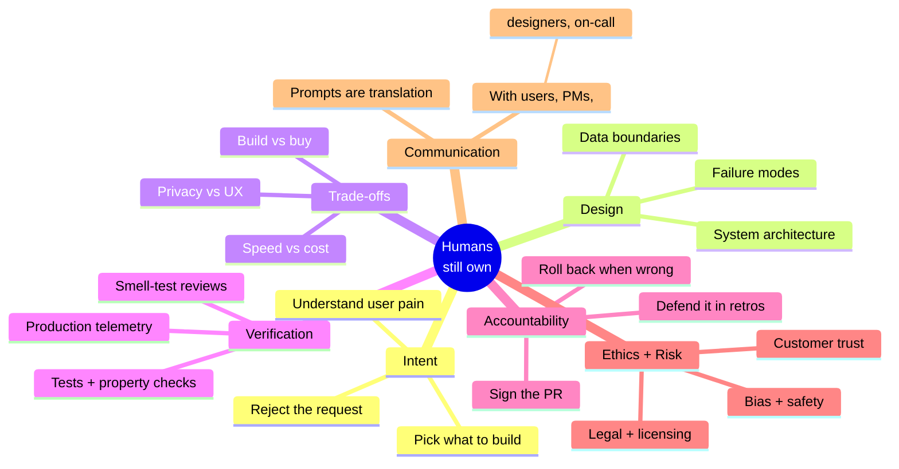

# The Seven Pillars Humans Still Own

When the interviewer asks "if AI can write the code, why do we still need you?",
this is the diagram in your head. Each pillar is a thing the model cannot do --
not because it lacks intelligence, but because it lacks **stake**.

## What to say out loud

> "Code is the cheapest part of software. Owning intent, design, trade-offs,
> verification, accountability, ethics, and communication is the expensive part
> -- and that is what I get paid for. The AI is a fast junior pair programmer
> who never reads a Slack thread."

## See also

- Chapter 2: `ai-interview-course/chapter-02-the-big-question/02-the-seven-pillars.md`
- Chapter 5: `ai-interview-course/chapter-05-system-design/01-what-humans-still-own.md`
