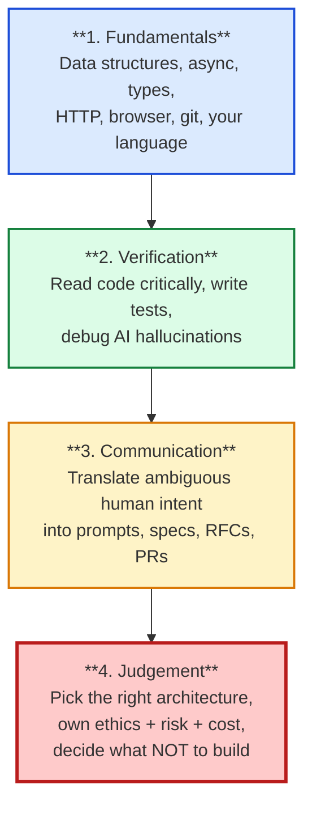

# The AI-Era Skill Stack

Every layer above is impossible without the layer below. Junior devs flame out
when they try to live on the top layer with no foundation.

## What to say out loud

> "AI compresses the time I spend on the bottom two layers, but the top two
> grow in importance. The reason teams still hire humans is judgement and
> communication -- the layers an LLM can't own because it has no stake in the
> outcome."

## See also

- Chapter 1: `ai-interview-course/chapter-01-foundations/02-the-skill-stack.md`
- Chapter 2: `ai-interview-course/chapter-02-the-big-question/02-the-seven-pillars.md`
