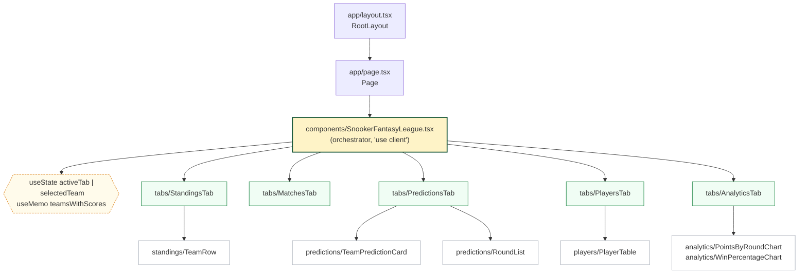

# React Architecture: Component Tree

The Next.js App Router renders this exact tree every time you visit `/`.
Memorize the boxes -- in an interview, you should be able to draw this on
a whiteboard before opening the editor.

## What to say out loud

> "There is exactly one stateful component -- the orchestrator. Every tab is a
> presentational view that receives teams and callbacks via props. State lives at
> the lowest common ancestor of every component that needs it."

## See also

- Chapter 4: `course/chapter-04-state-and-hooks/02-the-orchestrator-pattern.md`
- Chapter 5: `course/chapter-05-composition/01-when-to-split-components.md`
