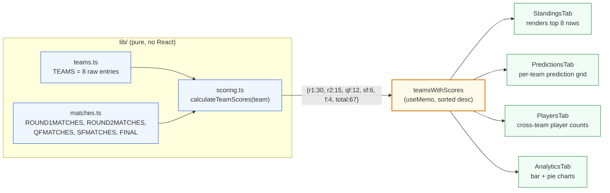

# React Data Flow: From `TEAMS` to Pixels

Pure data flows in one direction: `lib/teams.ts` → `calculateTeamScores` →
`teamsWithScores` (sorted) → tab components → DOM. No tab mutates the raw data.

## What to say out loud

> "There are three layers: pure data, a single derived projection, and views.
> Views are dumb. They get props in and emit clicks back up. If a number ever
> looks wrong, the bug is exactly one of `scoring.ts`, the raw data, or the
> formatter in the view -- never any deeper."

## See also

- Chapter 1: `course/chapter-01-foundations/03-pure-functions-and-scoring.md`
- Chapter 4: `course/chapter-04-state-and-hooks/03-useMemo-and-derived-data.md`
