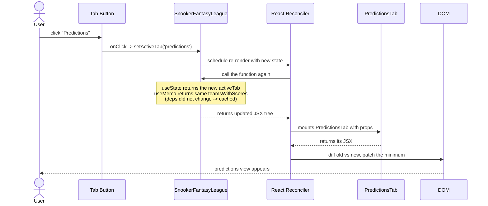

# React State Lifecycle: A User Click → A Re-render

Trace what happens when the user clicks the "Predictions" tab. Every step is
synchronous and pure -- React just schedules a re-render and asks the orchestrator
to give it the new tree.

## What to say out loud

> "Clicking a tab is just `setState`. React re-runs the orchestrator function
> top to bottom, but `useMemo` skips the expensive sort because its dependency
> array hasn't changed. The new JSX is diffed against the old DOM and only the
> affected nodes get touched."

## Why this matters in interviews

Interviewers ask: *"What happens when you click the tab?"* The wrong answer is
"React re-renders the whole page." The right answer is the sequence above:
state change → orchestrator re-runs → memoized derivations skip → reconciliation
patches the diff.

## See also

- Chapter 4: `course/chapter-04-state-and-hooks/01-useState-mental-model.md`
- Chapter 4: `course/chapter-04-state-and-hooks/02-the-orchestrator-pattern.md`
